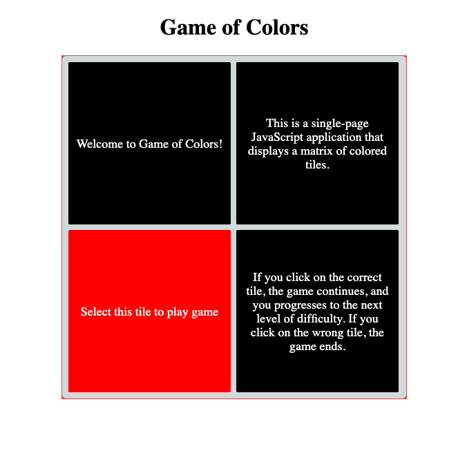
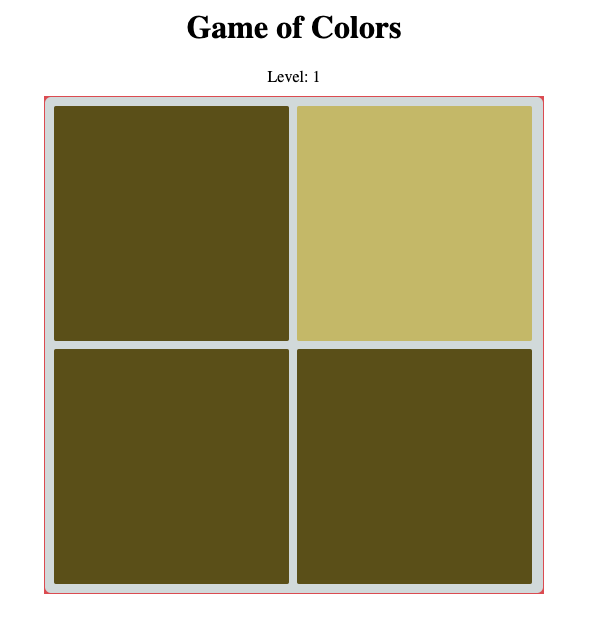
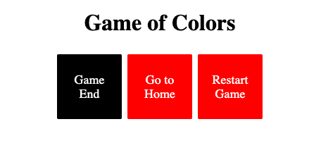

# Game of Colors


[Here](https://mitsuyacider.github.io/vue-simple-tile-game/#/) is demo site. You can play this application on the page.

# Overview

**My thought process:**

1. Understand the overview of the assignment
2. Set up a project using vue-cli(vue create app)
3. Implement and unit test
4. Integration Test

# How To Build And Run

## Build version and environment

| Package    | Version  |
| ---------- | :------- |
| node       | v12.16.1 |
| vue        | v3.0.0   |
| typescript | v3.9.3   |

### Project setup

```
yarn install
```

### Compiles and hot-reloads for development

```
yarn serve
```

This command runs a local server for development. You can test this application by accessing **http://0.0.0.0:8080/** over an arbitrary browser. If your laptop is running the other application on the port **8080**, change the port defined in **package.json** at **script.serve** property to a specific port. You can inspect the application on a smartphone browser, as long as the smartphone connects to the same network with your laptop. In that case, input the internal IP on your laptop and the port to the search box on the smartphone's browser. You can also use iOS simulator which is provided by Xcode.

### Compiles and minifies for production

```
yarn build
```

This command generates all necessary resources for the app into `dist` folder. Should change public path in `vue.config.js` for production when you upload resources to a certain sever. It would run locally at the moment because of the current public path setting. To run the app with the production assets locally, just open the generated `index.html` on an arbitary browser.

https://cli.vuejs.org/guide/deployment.html#general-guidelines

```js
// at vue.config.js
module.exports = {
  publicPath: process.env.NODE_ENV === 'production' ? '' : '/',
};
```

If you put your server directory for production, take another way which the following link recommends.
https://github.com/vuejs/vue-cli/issues/1955#issuecomment-408237701

### Run your unit tests

```
yarn test:unit
```

# How To Use

## Page route

This game application has the following pages with specific paths.
| Page | Path | Description |
| ------------- | -------------- | ---------------------------------------------------------------------------------------------------------------------- |
| Home | / | Display start button for the game |
| Game Play | /game | when the user has complete the game, got to Game End page. When the user click a wrong tile, go to Game End page. |
| Game End | /game-end | Display game over and restart button. |

The root path displays a Game Start page. You can start to play this game simply by clicking the red colored tile. This button takes the user to a Game Play page. Every time the user visits the Game Play page, the level of difficulty sets by 1(first level). When the user has selected all correct tile, it brings the user to a Game End page. When the user click a wrong tile, it goes to a Game End page as well. A Game End page displays a restart button to play the game again.

|              Home               |            Game Play            |         Game End Page          |
| :-----------------------------: | :-----------------------------: | :----------------------------: |
|  |  |  |

When clicked on the page tile, back to home.

# Browser Support

I checked the following browsers during development. This application supports mobile browsers as well as desktop ones.
| Browser | Version|
| ------- |----- |
| Chrome |v85.0.4183.121|
| Firefox |v81.0.1 |
| Safari |v13.1.2|
| Microsoft Edge |v38|
| Mobile Safari |iOS v13.4.1|

Unfortunately, Vue3 officially doesn't support IE browser yet because it uses JS Proxies for reactivity that doesn't understand by IE. I tried to support IE using polyfill but I couldn't find proper solutions during development.

# How The CSS Would Scale

## Calculate a tile size.

The tile size is calculated by the grid container size and the number of colums. Therefore you can adjust the tile size and the gap between tiles from the css properties of width, padding and border. The values of padding and border correspond to a gap value between tiles.

`src/composables/useTileGenerator.ts`

```ts
const calcTileSize = (element: HTMLElement | null, cols: number): number => {
...

  const innerWidth: number = width - padding - border;
  const tileSize: number = Math.floor(innerWidth / cols);

  return tileSize;

...
};
```

`src/components/TileGrid.vue`

```css
[class*='tile-grid']::before {
  content: '';
  position: absolute;
  top: 0;
  left: 0;
  z-index: 0;
  width: 100%;
  height: 100%;
  border-radius: 6px;
  background: #d7dedf;
}

[class*='tile-grid'] {
  width: 500px;

  margin: 0 auto;
  background: #e0555b;
  position: relative;
  padding: 5px;
  border: 1px solid #e0555b;

  /* Trim space */
  font-size: 0;
}

@media only screen and (max-width: 768px) {
  .tile-grid {
    width: 80vw;
  }
}
```

Currently the width of the grid container assigns a fixed size by 500px in PC. However you would scale the css to add optional modifier to the class such as --fluid-small, --fixed-small.

```css
.tile-grid--fluid-small {
  min-width: 300px;
  width: 50vw;
  max-width: 1000px;
}

.tile-grid--fluid-medium {
  min-width: 300px;
  width: 70vw;
  max-width: 1000px;
}

.tile-grid--fluid-big {
  min-width: 300px;
  width: 90vw;
  max-width: 1000px;
}

.tile-grid--fixed-small {
  width: 300px;
}

.tile-grid--fixed-medium {
  width: 500px;
}

.tile-grid--fixed-big {
  width: 1000px;
}
```

The usage would be:

```css
  // at TileGrid.vue
  <div class="tile-grid--fluid-small" ref="gridRef">
  </div>
```

## Resize tile size.

Observe window resize.

```ts
// at useWindowResize.ts
export const useWindowResize = () => {
...
  onMounted(() => window.addEventListener("resize", resize));
  onUnmounted(() => window.removeEventListener("resize", resize));
...
};
```

When the window size has changed, calculate tile size along with the grid container width.

```ts
// at Game.vue
watch(windowWidth, () => {
  if (!gridRef.value || !game.value) return;
  tileSize.value = calcTileSize(getGridElement(), game.value!.grid.cols);
});
```

```ts
// at useTileGenerator.ts
const generateTiles = (game: Game) => {
  tiles.splice(-tiles.length);
  const grid: TileGridProps = game.grid;

  // NOTE: Create tile config
  const totalTile = grid.cols * grid.rows;

  // NOTE: Generate correct tile index randomly.
  const correctIndex = Math.floor(Math.random() * totalTile);

  for (let i = 0; i < totalTile; i++) {
    const tile: TileProps = {
      color: game.tileColor,
      isCorrect: correctIndex === i,
    };

    tiles.push(tile);
  }
};
```

# Code Quality.

## Game Data Maintainability

Grid data of each level stores in `src/packages/data/grids.ts`.
You can set up how many tiles on a grid layout display in the browser. I assumed the data would come from server side and no other modification need for the number of tiles. Therefore I ensure the maintanability in terms of the game configuration.

```ts
export const LEVEL1_GRID: TileGridProps = {
  cols: 2,
  rows: 2,
};
```

You can also change the configuration for a pair of correct and wrong colors in `src/packages/data/colors.ts`.

```ts
export const LEVEL1_COLOR: TileColor = {
  correct: '#CBC073',
  wrong: '#655919',
};
```

The final data structure for a certain game level from server would expect below.

```ts
{
    level: 1,
    tileColor: {
        correct: '#CBC073',
        wrong:'#655919',
    },
    grid: {
        cols: 2,
        rows: 2,
    },
    isFinalLevel: false,
},
```

If the game data contains `isFinalLevel: true`, the application ends up at the level and navigates to a Game End page.

## Reusability

I made a tile component reusable and customizable. I extended it to CharTile.vue used in Home.vue and Game.vue. Tile component is a sort of base component. CharTile can insert elements within `<slot name="char-tile">` where locates in Tile.vue. The usage of CharTile is the same way as Tile component because of the inheritance.

`Tile.vue`

```html
<div
  class="tile__inner"
  :style="getTileInnerStyle()"
  @click="$emit('clickTile', tile)"
>
  <slot name="char-tile"></slot>
</div>
```

`CharTile.vue`

```html
<Tile
  :tileSize="tileSize"
  :tile="tile"
  v-on:clickTile="$emit('clickTile', tile)"
>
  <template #char-tile>
    <div class="char-tile">{{ tile.text }}</div>
  </template>
</Tile>
```

`Home.vue`

```html
<TileGrid :game="startGame" ref="gridRef">
  <template #game-tile>
    <CharTile
      v-on:clickTile="handleStartTileClick"
      v-for="(value, index) in tiles"
      :key="index"
      :tileSize="tileSize"
      :tile="value"
      :class="{ clickable: value.isCorrect }"
    />
  </template>
</TileGrid>
```

`GameEnd.vue`

```html
<CharTile :tile="tiles[0]" />
```
